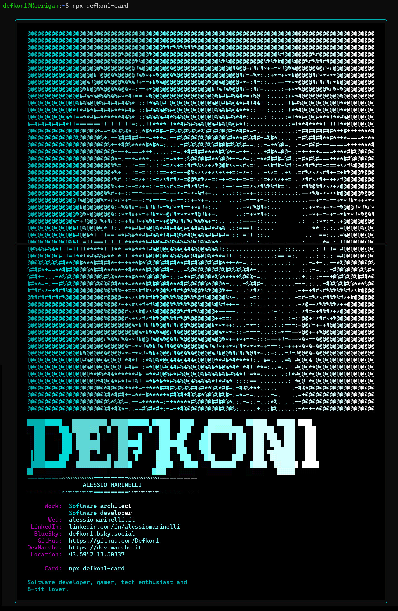

# Defkon1 CLI Card - forked from M365 Princess CLI Card

> A personalized CLI calling card for Alessio Marinelli

In case you ever need my information and all you have is a terminal and `npm`.

## Usage

```bash
npx defkon1-card
```

That's it! No installation required.

## What You'll See




## Dependencies

- [boxen](https://www.npmjs.com/package/boxen) - Terminal boxes
- [chalk](https://www.npmjs.com/package/chalk) - Terminal string styling
- [gradient-string](https://www.npmjs.com/package/gradient-string) - Gradient colors

## Credits

This project is derived from [Luise Freese (M365 princess)](https://github.com/LuiseFreese)'s work.

Please refer to her [original repository](https://github.com/LuiseFreese/m365princess-card) to learn how to build your own CLI card (and leave a star!).

## License

MIT License.

## Contributing

Found a bug or want to suggest an improvement? Open an issue or submit a PR!

**Try my card:** `npx defkon1-card`